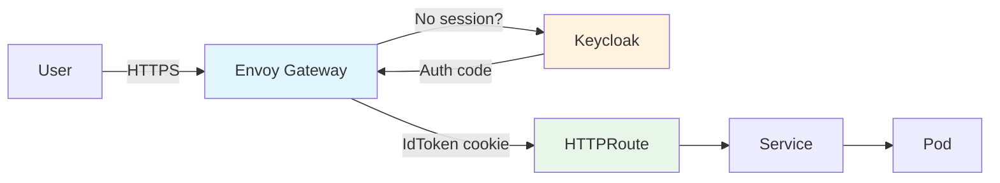

# Nebari Software Pack Template

[](https://github.com/nebari-dev/nebari-software-pack-template/actions/workflows/lint.yaml)
[](https://github.com/nebari-dev/nebari-software-pack-template/actions/workflows/test.yaml)

A template repository for building **Nebari Software Packs** - Helm charts that
deploy applications on the [Nebari](https://nebari.dev) platform with optional
routing, TLS, and OIDC authentication.

## Table of Contents

- [What is a Nebari Software Pack?](#what-is-a-nebari-software-pack)
- [Prerequisites](#prerequisites)
- [Getting Started](#getting-started)
- [Repository Structure](#repository-structure)
- [The NebariApp CRD](#the-nebariapp-crd)
- [Example 1: Basic Pack (Nginx)](#example-1-basic-pack-nginx)
- [Example 2: Auth-Aware Pack (FastAPI)](#example-2-auth-aware-pack-fastapi)
- [Example 3: Wrapping an Existing Chart (Podinfo)](#example-3-wrapping-an-existing-chart-podinfo)
- [How Authentication Works](#how-authentication-works)
- [Local Development](#local-development)
- [CI/CD Pipeline](#cicd-pipeline)
- [Deploying to a Nebari Cluster](#deploying-to-a-nebari-cluster)
- [Customizing for Your Own Application](#customizing-for-your-own-application)
- [Troubleshooting](#troubleshooting)

## What is a Nebari Software Pack?

A **software pack** is a Helm chart that packages an application for deployment on
the Nebari platform. What makes it a "pack" (rather than just a Helm chart) is the
optional **NebariApp** custom resource that tells the
[nebari-operator](https://github.com/nebari-dev/nebari-operator) to auto-configure:

- **Routing** - Creates an HTTPRoute on the shared Envoy Gateway
- **TLS** - Provisions a certificate via cert-manager
- **Authentication** - Sets up Keycloak OIDC via an Envoy Gateway SecurityPolicy



Without `nebariapp.enabled`, the chart works like any standard Helm chart.
With it enabled, the nebari-operator handles all the platform integration automatically.

## Prerequisites

- [Docker](https://docs.docker.com/get-docker/)
- [Helm 3](https://helm.sh/docs/intro/install/)
- [kubectl](https://kubernetes.io/docs/tasks/tools/)

For local development (optional):
- [k3d](https://k3d.io/)
- [ctlptl](https://github.com/tilt-dev/ctlptl)
- [Tilt](https://docs.tilt.dev/install.html)

## Getting Started

1. **Use this template** - Click "Use this template" on GitHub to create your own repo

2. **Clone your new repo**
   ```bash
   git clone https://github.com/YOUR-ORG/YOUR-REPO.git
   cd YOUR-REPO
   ```

3. **Pick an example** that matches your use case:
   - `examples/basic-nginx/` - Deploying a simple container
   - `examples/auth-fastapi/` - Building a custom app that reads auth tokens
   - `examples/wrap-existing-chart/` - Wrapping an existing Helm chart (most common)

4. **Search and replace** `my-pack` with your pack name:
   ```bash
   # Preview changes
   grep -r "my-pack" examples/basic-nginx/

   # Replace (using your pack name)
   find . -type f -name "*.yaml" -o -name "*.tpl" -o -name "*.txt" -o -name "Makefile" -o -name "Tiltfile" | \
     xargs sed -i 's/my-pack/your-pack-name/g'
   ```

5. **Deploy locally** to test:
   ```bash
   helm install test examples/basic-nginx/chart/
   kubectl port-forward svc/test-my-pack 8080:80
   # Open http://localhost:8080
   ```

## Repository Structure

```
nebari-software-pack-template/
  .github/workflows/
    lint.yaml                    # Helm lint + template validation (all 3 examples)
    test.yaml                    # k3d integration tests
    release.yaml                 # Helm package + GitHub release + gh-pages index
  examples/
    basic-nginx/                 # Example 1: Simplest possible pack
      chart/
        Chart.yaml
        values.yaml
        templates/
          _helpers.tpl           # Name, label, selector helpers
          nebariapp.yaml         # NebariApp CRD (conditional)
          deployment.yaml        # Kubernetes Deployment
          service.yaml           # ClusterIP Service
          NOTES.txt              # Post-install instructions
      README.md
    auth-fastapi/                # Example 2: Custom app reading IdToken
      app/
        main.py                  # FastAPI reading IdToken cookie
        requirements.txt
        templates/index.html     # User info display
      Dockerfile
      chart/                     # Same structure as basic-nginx
      README.md
    wrap-existing-chart/         # Example 3: Wrapping podinfo
      chart/
        Chart.yaml               # Has podinfo as a dependency
        Chart.lock
        values.yaml              # Podinfo overrides + NebariApp config
        templates/
          _helpers.tpl
          nebariapp.yaml         # Points to podinfo's service
          NOTES.txt
      README.md
  dev/
    Makefile                     # make up-basic / up-fastapi / up-podinfo / down
    Tiltfile                     # Live-reload for FastAPI example
    ctlptl-config.yaml           # k3d cluster + local registry
  docs/
    nebariapp-crd-reference.md   # Full NebariApp field reference
    auth-flow.md                 # Authentication flow details
  .gitignore
  .editorconfig
  LICENSE                        # Apache 2.0
  README.md                      # This file
```

## The NebariApp CRD

The **NebariApp** custom resource is the integration point between your pack and the
Nebari platform. When you create a NebariApp, the
[nebari-operator](https://github.com/nebari-dev/nebari-operator) watches for it and
automatically configures routing, TLS, and authentication.

Here's a fully annotated example:

```yaml
apiVersion: reconcilers.nebari.dev/v1
kind: NebariApp
metadata:
  name: my-pack
spec:
  # The domain where your app will be accessible
  hostname: my-pack.nebari.example.com

  # The Kubernetes Service that should receive traffic
  service:
    name: my-pack           # Service name in the same namespace
    port: 80                # Service port (1-65535)

  # Optional: path-based routing rules
  routing:
    routes:
      - pathPrefix: /       # Match all paths (default behavior)
        pathType: PathPrefix # PathPrefix or Exact
    tls:
      enabled: true         # Auto-provision TLS certificate (default: true)

  # Optional: OIDC authentication
  auth:
    enabled: true                   # Require login (default: false)
    provider: keycloak              # keycloak or generic-oidc
    provisionClient: true           # Auto-create Keycloak client (default: true)
    redirectURI: /                  # OAuth callback path
    scopes:                         # OIDC scopes to request
      - openid
      - profile
      - email
    groups:                         # Restrict to specific groups (optional)
      - admin
    enforceAtGateway: true          # Create SecurityPolicy at gateway (default: true)

  # Which gateway to use: "public" (default) or "internal"
  gateway: public
```

In your Helm chart, this is rendered conditionally in `templates/nebariapp.yaml`:

```yaml
{{- if .Values.nebariapp.enabled }}
apiVersion: reconcilers.nebari.dev/v1
kind: NebariApp
...
{{- end }}
```

When `nebariapp.enabled` is `false` (the default), no NebariApp is created and the
chart works as a standalone Helm chart.

For the complete field reference, see [docs/nebariapp-crd-reference.md](docs/nebariapp-crd-reference.md).

## Example 1: Basic Pack (Nginx)

The simplest possible pack. Deploys a stock nginx container with optional Nebari integration.

**What it demonstrates:**
- Minimum viable chart structure
- Conditional NebariApp template
- Toggling between standalone and Nebari modes

```bash
# Deploy standalone
helm install test-basic examples/basic-nginx/chart/
kubectl port-forward svc/test-basic-my-pack 8080:80
# Open http://localhost:8080

# Deploy on Nebari
helm install my-pack examples/basic-nginx/chart/ \
  --set nebariapp.enabled=true \
  --set nebariapp.hostname=my-pack.nebari.example.com

# Deploy on Nebari with auth
helm install my-pack examples/basic-nginx/chart/ \
  --set nebariapp.enabled=true \
  --set nebariapp.hostname=my-pack.nebari.example.com \
  --set nebariapp.auth.enabled=true
```

See [examples/basic-nginx/README.md](examples/basic-nginx/README.md) for the full walkthrough.

## Example 2: Auth-Aware Pack (FastAPI)

A custom Python app that reads the IdToken cookie set by Envoy Gateway after
Keycloak authentication. Shows how to consume authenticated user identity.

**What it demonstrates:**
- Building a custom container image
- Reading the IdToken cookie to get user claims
- Rendering user info (username, email, groups)

The key code in `app/main.py`:

```python
def get_id_token(request: Request) -> str | None:
    """Extract IdToken from Envoy Gateway's OIDC filter cookies.

    Envoy Gateway sets a cookie named IdToken-<suffix> where <suffix>
    is an 8-char hex string derived from the SecurityPolicy UID.
    """
    for name, value in request.cookies.items():
        if name.startswith("IdToken-"):
            return value
    return None
```

```bash
# Build the image
docker build -t my-pack-fastapi:latest examples/auth-fastapi/

# Run locally (shows "Not Authenticated" - no IdToken cookie without Envoy Gateway)
docker run -p 8000:8000 my-pack-fastapi:latest

# Deploy on Nebari with auth
helm install my-pack examples/auth-fastapi/chart/ \
  --set nebariapp.enabled=true \
  --set nebariapp.hostname=my-pack.nebari.example.com \
  --set image.repository=your-registry/my-pack-fastapi
```

See [examples/auth-fastapi/README.md](examples/auth-fastapi/README.md) for the full walkthrough.

## Example 3: Wrapping an Existing Chart (Podinfo)

**This is the most realistic use case.** Most packs wrap existing software - you
don't write your own Deployment or Service. You add the upstream chart as a dependency
and create a NebariApp that points to its service.

**What it demonstrates:**
- Chart.yaml dependency on an existing chart
- Overriding upstream values
- NebariApp pointing to the upstream service
- No custom Deployment or Service templates needed

```yaml
# Chart.yaml - just add the dependency
dependencies:
  - name: podinfo
    version: 6.10.1
    repository: oci://ghcr.io/stefanprodan/charts
```

The only template you write is `nebariapp.yaml`, which points to podinfo's service:

```yaml
spec:
  service:
    name: {{ .Release.Name }}-podinfo   # Upstream service
    port: 9898
```

**You don't rewrite the app. You just connect it to Nebari.**

```bash
# Build dependencies
helm dependency update examples/wrap-existing-chart/chart/

# Deploy standalone
helm install test-podinfo examples/wrap-existing-chart/chart/
kubectl port-forward svc/test-podinfo-podinfo 9898:9898

# Deploy on Nebari
helm install my-pack examples/wrap-existing-chart/chart/ \
  --set nebariapp.enabled=true \
  --set nebariapp.hostname=my-pack.nebari.example.com
```

See [examples/wrap-existing-chart/README.md](examples/wrap-existing-chart/README.md) for the full walkthrough.

## How Authentication Works

When a NebariApp has `auth.enabled: true`, the nebari-operator creates an Envoy
Gateway SecurityPolicy that handles the full OIDC flow:

```
1. User visits my-pack.nebari.example.com
2. Envoy Gateway checks for a valid session cookie
   - No cookie? Redirect to Keycloak login page
3. User authenticates with Keycloak
4. Keycloak redirects back with an authorization code
5. Envoy Gateway exchanges the code for tokens
6. Envoy Gateway sets cookies:
   - IdToken-<suffix>     (JWT with user claims)
   - AccessToken-<suffix>
   - RefreshToken-<suffix>
   (<suffix> is an 8-char hex derived from the SecurityPolicy UID)
7. Request (now with cookies) is forwarded to your app
```

**What the operator automates:**
- Creates a Keycloak OIDC client (when `provisionClient: true`)
- Stores client credentials in a Kubernetes Secret
- Creates an Envoy Gateway SecurityPolicy with the OIDC configuration
- Creates an HTTPRoute directing traffic to your service
- Provisions a TLS certificate via cert-manager

**What your app can do:**
- Read the `IdToken-*` cookies to get the JWT (see Example 2)
- Decode the JWT payload to extract claims: `preferred_username`, `email`, `groups`
- The JWT signature is already verified by Envoy Gateway - you only need to base64-decode the payload

**If your app handles OAuth natively** (like Grafana), set `enforceAtGateway: false`.
The operator will still provision the OIDC client and store credentials in a Secret,
but won't create a SecurityPolicy. Your app reads the credentials from the Secret
and handles the OAuth flow itself.

For more details, see [docs/auth-flow.md](docs/auth-flow.md).

## Local Development

The `dev/` directory provides tooling for local development with k3d.

### Quick start with Makefile

```bash
cd dev

# Deploy nginx example
make up-basic

# Deploy podinfo example
make up-podinfo

# Build and deploy FastAPI example
make up-fastapi

# Tear down everything
make down
```

### Live-reload with Tilt

For the FastAPI example, Tilt provides live-reload on code changes:

```bash
cd dev
make cluster          # Create k3d cluster (if not exists)
tilt up               # Start Tilt - opens UI at http://localhost:10350
```

Tilt will:
- Build the FastAPI Docker image
- Push to the local registry
- Deploy via Helm
- Watch for file changes and auto-rebuild

### Limitations

- **No auth locally** - The OIDC flow requires Keycloak and Envoy Gateway, which
  are part of the Nebari platform. The FastAPI example will show "Not Authenticated"
  when running locally.
- **NebariApp CRD not available** - The NebariApp CRD only exists on clusters with
  the nebari-operator. Always set `nebariapp.enabled=false` for local development.

## CI/CD Pipeline

### Lint (`lint.yaml`)

Runs on every push and PR. Validates all three example charts:

- `helm lint` for each chart
- `helm template` with NebariApp disabled (standalone mode)
- `helm template` with NebariApp enabled (Nebari mode)

### Test (`test.yaml`)

Runs on every push and PR. Integration tests on a kind cluster:

- Creates a kind cluster
- Installs the basic-nginx chart, waits for pods, runs health check
- Installs the podinfo wrapper chart, waits for pods, runs health check

### Release (`release.yaml`)

Manual dispatch. Packages and releases a chart:

- Packages the selected chart as a `.tgz`
- Creates a GitHub release with the package
- Updates the `gh-pages` branch with a Helm repo index

## Deploying to a Nebari Cluster

### Option A: Helm install

```bash
helm install my-pack ./chart/ \
  --namespace my-pack \
  --create-namespace \
  --set nebariapp.enabled=true \
  --set nebariapp.hostname=my-pack.nebari.example.com \
  --set nebariapp.auth.enabled=true
```

### Option B: ArgoCD Application (recommended)

```yaml
apiVersion: argoproj.io/v1alpha1
kind: Application
metadata:
  name: my-pack
  namespace: argocd
spec:
  project: default
  source:
    repoURL: https://github.com/YOUR-ORG/YOUR-REPO.git
    targetRevision: main
    path: examples/basic-nginx/chart    # or your chart path
    helm:
      valuesObject:
        nebariapp:
          enabled: true
          hostname: my-pack.nebari.example.com
          auth:
            enabled: true
  destination:
    server: https://kubernetes.default.svc
    namespace: my-pack
  syncPolicy:
    automated:
      prune: true
      selfHeal: true
    syncOptions:
      - CreateNamespace=true
```

### Verifying the deployment

```bash
# Check the NebariApp status
kubectl get nebariapp -n my-pack

# Check conditions (should all be True when ready)
kubectl describe nebariapp my-pack -n my-pack

# Expected conditions:
#   RoutingReady: True    - HTTPRoute created
#   TLSReady: True        - Certificate provisioned
#   AuthReady: True       - SecurityPolicy created (if auth enabled)
#   Ready: True           - All components ready
```

## Customizing for Your Own Application

### Search and replace

| Token | Replace with | Where |
|-------|-------------|-------|
| `my-pack` | Your pack name (lowercase, hyphenated) | All chart files, Makefile, Tiltfile, ctlptl-config |
| `OWNER/REPO` or `YOUR-ORG/YOUR-REPO` | Your GitHub org/repo | Workflows, README |

The placeholder `my-pack` is valid YAML/Helm syntax, so `helm lint` passes on the
template repo as-is.

### Replacing the container image

In `values.yaml`, change the `image` section:

```yaml
image:
  repository: your-registry/your-image
  tag: "1.0.0"
```

### Adding resources

Common additions to `templates/`:

- **ConfigMap** - Configuration files mounted into pods
- **Secret** - Credentials (use `lookup()` for ArgoCD safety)
- **PersistentVolumeClaim** - Persistent storage
- **ServiceAccount** - Pod identity for RBAC

### Multiple routes

If your app serves multiple paths:

```yaml
nebariapp:
  routing:
    routes:
      - pathPrefix: /api
        pathType: PathPrefix
      - pathPrefix: /dashboard
        pathType: PathPrefix
```

### Restricting access to specific groups

```yaml
nebariapp:
  auth:
    enabled: true
    groups:
      - admin
      - data-science-team
```

## Troubleshooting

### NebariApp shows `NamespaceNotOptedIn`

The namespace needs the label that opts it in for nebari-operator processing:

```bash
kubectl label namespace my-pack nebari.dev/managed=true
```

### NebariApp shows `ServiceNotFound`

The NebariApp's `spec.service.name` doesn't match any Service in the namespace.
Check the service name:

```bash
kubectl get svc -n my-pack
```

For wrapped charts, the service name follows the upstream chart's naming convention
(usually `<release>-<chart-name>`).

### Auth not working / no redirect to Keycloak

1. Check that `nebariapp.auth.enabled` is `true`
2. Check that the nebari-operator is running:
   ```bash
   kubectl get pods -n nebari-system -l app=nebari-operator
   ```
3. Check the NebariApp conditions:
   ```bash
   kubectl describe nebariapp my-pack -n my-pack
   ```
   Look for `AuthReady` condition.

### TLS certificate not provisioning

1. Check cert-manager is running:
   ```bash
   kubectl get pods -n cert-manager
   ```
2. Check the Certificate resource:
   ```bash
   kubectl get certificate -n my-pack
   kubectl describe certificate my-pack-tls -n my-pack
   ```

### No IdToken cookie in the app

1. Ensure you're accessing through the configured hostname (not via port-forward)
2. Check that the SecurityPolicy was created:
   ```bash
   kubectl get securitypolicy -n my-pack
   ```
3. Check Envoy Gateway logs:
   ```bash
   kubectl logs -n envoy-gateway-system -l app=envoy-gateway
   ```

### `helm dependency update` fails for wrapped charts

For OCI-based dependencies, ensure Helm 3.8+ is installed:

```bash
helm version
helm dependency update examples/wrap-existing-chart/chart/
```

## License

Apache 2.0 - see [LICENSE](LICENSE).
