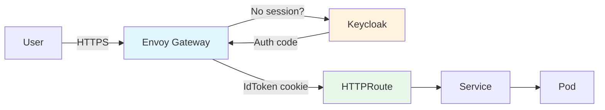

# Nebari Software Pack Template

[](https://github.com/nebari-dev/nebari-software-pack-template/actions/workflows/lint.yaml)
[](https://github.com/nebari-dev/nebari-software-pack-template/actions/workflows/test.yaml)
[](https://github.com/nebari-dev/nebari-software-pack-template/actions/workflows/test-integration.yaml)

A template repository for building **Nebari Software Packs** - Kubernetes
applications that deploy on the [Nebari](https://nebari.dev) platform with
optional routing, TLS, and OIDC authentication.

## Table of Contents

- [What is a Nebari Software Pack?](#what-is-a-nebari-software-pack)
- [Prerequisites](#prerequisites)
- [Getting Started](#getting-started)
- [Repository Structure](#repository-structure)
- [The NebariApp CRD](#the-nebariapp-crd)
- [Example 1: Vanilla YAML (Plain Manifests)](#example-1-vanilla-yaml-plain-manifests)
- [Example 2: Kustomize (Nginx)](#example-2-kustomize-nginx)
- [Example 3: Helm - Basic Pack (Nginx)](#example-3-helm---basic-pack-nginx)
- [Example 4: Helm - Auth-Aware Pack (FastAPI)](#example-4-helm---auth-aware-pack-fastapi)
- [Example 5: Helm - Wrapping an Existing Chart (Podinfo)](#example-5-helm---wrapping-an-existing-chart-podinfo)
- [How Authentication Works](#how-authentication-works)
- [Local Development](#local-development)
- [CI/CD Pipeline](#cicd-pipeline)
- [Deploying to a Nebari Cluster](#deploying-to-a-nebari-cluster)
- [Customizing for Your Own Application](#customizing-for-your-own-application)
- [Troubleshooting](#troubleshooting)

## What is a Nebari Software Pack?

A **software pack** is any Kubernetes deployment that includes a **NebariApp**
custom resource. The NebariApp tells the
[nebari-operator](https://github.com/nebari-dev/nebari-operator) to auto-configure:

- **Routing** - Creates an HTTPRoute on the shared Envoy Gateway
- **TLS** - Provisions a certificate via cert-manager
- **Authentication** - Sets up Keycloak OIDC via an Envoy Gateway SecurityPolicy

The NebariApp CRD is the integration point between your application and the
Nebari platform. How you deploy the rest of your application is up to you -
**Helm charts, Kustomize overlays, and plain YAML manifests** are all supported.
All three are first-class deployment methods in ArgoCD.



## Prerequisites

- [kubectl](https://kubernetes.io/docs/tasks/tools/)

Depending on your deployment method:
- [Helm 3](https://helm.sh/docs/intro/install/) (for Helm examples)
- [Docker](https://docs.docker.com/get-docker/) (for building custom images)

For local development (optional):
- [kind](https://kind.sigs.k8s.io/)

## Getting Started

1. **Use this template** - Click "Use this template" on GitHub to create your own repo

2. **Clone your new repo**
   ```bash
   git clone https://github.com/YOUR-ORG/YOUR-REPO.git
   cd YOUR-REPO
   ```

3. **Pick an example** that matches your use case:

   **No tooling dependencies:**
   - `examples/vanilla-yaml/` - Plain YAML manifests, just `kubectl apply`
   - `examples/kustomize-nginx/` - Kustomize overlays for per-environment config

   **Helm-based:**
   - `examples/basic-nginx/` - Simplest possible Helm chart
   - `examples/auth-fastapi/` - Custom app that reads auth tokens
   - `examples/wrap-existing-chart/` - Wrapping an existing Helm chart (most common for Helm)

4. **Search and replace** `my-pack` with your pack name:
   ```bash
   # Preview changes
   grep -r "my-pack" examples/vanilla-yaml/

   # Replace (using your pack name)
   find . -type f -name "*.yaml" -o -name "*.tpl" -o -name "*.txt" -o -name "Makefile" | \
     xargs sed -i 's/my-pack/your-pack-name/g'
   ```

5. **Deploy locally** to test:
   ```bash
   # Vanilla YAML (simplest)
   kubectl apply -f examples/vanilla-yaml/deployment.yaml \
                 -f examples/vanilla-yaml/service.yaml
   kubectl port-forward svc/my-pack 8080:80

   # Or with Helm
   helm install test examples/basic-nginx/chart/
   kubectl port-forward svc/test-my-pack 8080:80

   # Open http://localhost:8080
   ```

## Repository Structure

```
nebari-software-pack-template/
  .github/workflows/
    build-image.yaml             # Build + publish auth-fastapi image to GHCR
    lint.yaml                    # Manifest validation (all examples)
    test.yaml                    # Integration tests on kind cluster
    test-integration.yaml        # NebariApp integration tests (full stack)
    release.yaml                 # Helm package + GitHub release + gh-pages index
  examples/
    vanilla-yaml/                # Example 1: Plain Kubernetes manifests
      deployment.yaml            # nginx Deployment
      service.yaml               # ClusterIP Service
      nebariapp.yaml             # NebariApp CRD resource
      README.md
    kustomize-nginx/             # Example 2: Kustomize-based pack
      base/
        kustomization.yaml       # References base resources
        deployment.yaml
        service.yaml
        nebariapp.yaml
      overlays/
        dev/                     # Dev overlay: dev hostname, no auth
          kustomization.yaml
          nebariapp-patch.yaml
        production/              # Prod overlay: prod hostname, auth + groups
          kustomization.yaml
          nebariapp-patch.yaml
      README.md
    basic-nginx/                 # Example 3: Simplest Helm chart
      chart/
        Chart.yaml
        values.yaml
        templates/
          _helpers.tpl           # Name, label, selector helpers
          nebariapp.yaml         # NebariApp CRD (conditional)
          deployment.yaml        # Kubernetes Deployment
          service.yaml           # ClusterIP Service
          NOTES.txt              # Post-install instructions
      README.md
    auth-fastapi/                # Example 4: Custom app reading IdToken
      app/
        main.py                  # FastAPI reading IdToken cookie
        requirements.txt
        templates/index.html     # User info display
      Dockerfile
      chart/                     # Same structure as basic-nginx
      README.md
    wrap-existing-chart/         # Example 5: Wrapping podinfo via Helm
      chart/
        Chart.yaml               # Has podinfo as a dependency
        Chart.lock
        values.yaml              # Podinfo overrides + NebariApp config
        templates/
          _helpers.tpl
          nebariapp.yaml         # Points to podinfo's service
          NOTES.txt
      README.md
  dev/
    Makefile                     # Local dev with full Nebari stack on kind
    .cache/                      # (gitignored) Cloned nebari-operator scripts
  docs/
    nebariapp-crd-reference.md   # Full NebariApp field reference
    auth-flow.md                 # Authentication flow details
  .gitignore
  .editorconfig
  LICENSE                        # Apache 2.0
  README.md                      # This file
```

## The NebariApp CRD

The **NebariApp** custom resource is the integration point between your pack and the
Nebari platform. When you create a NebariApp, the
[nebari-operator](https://github.com/nebari-dev/nebari-operator) watches for it and
automatically configures routing, TLS, and authentication.

Here's a fully annotated example:

```yaml
apiVersion: reconcilers.nebari.dev/v1
kind: NebariApp
metadata:
  name: my-pack
spec:
  # The domain where your app will be accessible
  hostname: my-pack.nebari.example.com

  # The Kubernetes Service that should receive traffic
  service:
    name: my-pack           # Service name in the same namespace
    port: 80                # Service port (1-65535)

  # Optional: path-based routing rules
  routing:
    routes:
      - pathPrefix: /       # Match all paths (default behavior)
        pathType: PathPrefix # PathPrefix or Exact
    tls:
      enabled: true         # Auto-provision TLS certificate (default: true)

  # Optional: OIDC authentication
  auth:
    enabled: true                   # Require login (default: false)
    provider: keycloak              # keycloak or generic-oidc
    provisionClient: true           # Auto-create Keycloak client (default: true)
    redirectURI: /                  # OAuth callback path
    scopes:                         # OIDC scopes to request
      - openid
      - profile
      - email
    groups:                         # Restrict to specific groups (optional)
      - admin
    enforceAtGateway: true          # Create SecurityPolicy at gateway (default: true)

  # Which gateway to use: "public" (default) or "internal"
  gateway: public
```

The NebariApp is just a Kubernetes resource. It can live in a plain YAML file, a
Kustomize base, or a Helm template. In Helm charts, you can make the NebariApp
conditional so the chart works both standalone and on Nebari:

```yaml
{{- if .Values.nebariapp.enabled }}
apiVersion: reconcilers.nebari.dev/v1
kind: NebariApp
...
{{- end }}
```

With plain YAML or Kustomize, the NebariApp manifest is always present. When
deploying standalone, simply skip that file or exclude it from your apply command.

For the complete field reference, see [docs/nebariapp-crd-reference.md](docs/nebariapp-crd-reference.md).

## Example 1: Vanilla YAML (Plain Manifests)

The simplest possible pack. Plain Kubernetes manifests with no tooling
dependencies beyond `kubectl`.

**What it demonstrates:**
- Lowest barrier to entry
- NebariApp as a plain YAML file alongside Deployment and Service
- No templating or tooling required

```bash
# Deploy standalone (skip the NebariApp)
kubectl apply -f examples/vanilla-yaml/deployment.yaml \
              -f examples/vanilla-yaml/service.yaml
kubectl port-forward svc/my-pack 8080:80
# Open http://localhost:8080

# Deploy on Nebari (edit nebariapp.yaml hostname first)
kubectl apply -f examples/vanilla-yaml/
```

See [examples/vanilla-yaml/README.md](examples/vanilla-yaml/README.md) for the full walkthrough.

## Example 2: Kustomize (Nginx)

Uses [Kustomize](https://kustomize.io/) overlays to manage environment-specific
NebariApp configuration. Same nginx app as the vanilla example, but with
structured per-environment patches.

**What it demonstrates:**
- Kustomize base with overlays for dev and production
- Patching hostname and auth settings per environment
- No Helm dependency

```bash
# Preview the dev overlay
kubectl kustomize examples/kustomize-nginx/overlays/dev/

# Deploy the dev overlay on Nebari
kubectl apply -k examples/kustomize-nginx/overlays/dev/

# Deploy the production overlay (auth enabled, group-restricted)
kubectl apply -k examples/kustomize-nginx/overlays/production/
```

See [examples/kustomize-nginx/README.md](examples/kustomize-nginx/README.md) for the full walkthrough.

## Example 3: Helm - Basic Pack (Nginx)

The simplest possible Helm-based pack. Deploys a stock nginx container with
optional Nebari integration via a conditional NebariApp template.

**What it demonstrates:**
- Minimum viable Helm chart structure
- Conditional NebariApp template (`nebariapp.enabled` toggle)
- Toggling between standalone and Nebari modes

```bash
# Deploy standalone
helm install test-basic examples/basic-nginx/chart/
kubectl port-forward svc/test-basic-my-pack 8080:80
# Open http://localhost:8080

# Deploy on Nebari
helm install my-pack examples/basic-nginx/chart/ \
  --set nebariapp.enabled=true \
  --set nebariapp.hostname=my-pack.nebari.example.com

# Deploy on Nebari with auth
helm install my-pack examples/basic-nginx/chart/ \
  --set nebariapp.enabled=true \
  --set nebariapp.hostname=my-pack.nebari.example.com \
  --set nebariapp.auth.enabled=true
```

See [examples/basic-nginx/README.md](examples/basic-nginx/README.md) for the full walkthrough.

## Example 4: Helm - Auth-Aware Pack (FastAPI)

A custom Python app that reads the IdToken cookie set by Envoy Gateway after
Keycloak authentication. Shows how to consume authenticated user identity.

**What it demonstrates:**
- Building a custom container image
- Reading the IdToken cookie to get user claims
- Rendering user info (username, email, groups)

The key code in `app/main.py`:

```python
def get_id_token(request: Request) -> str | None:
    """Extract IdToken from Envoy Gateway's OIDC filter cookies.

    Envoy Gateway sets a cookie named IdToken-<suffix> where <suffix>
    is an 8-char hex string derived from the SecurityPolicy UID.
    """
    for name, value in request.cookies.items():
        if name.startswith("IdToken-"):
            return value
    return None
```

```bash
# Run locally (shows "Not Authenticated" - no IdToken cookie without Envoy Gateway)
docker run -p 8000:8000 ghcr.io/nebari-dev/nebari-software-pack-template/auth-fastapi-example:latest

# Deploy on Nebari with auth
helm install my-pack examples/auth-fastapi/chart/ \
  --set nebariapp.enabled=true \
  --set nebariapp.hostname=my-pack.nebari.example.com
```

See [examples/auth-fastapi/README.md](examples/auth-fastapi/README.md) for the full walkthrough.

## Example 5: Helm - Wrapping an Existing Chart (Podinfo)

**This is the most realistic Helm use case.** Most Helm-based packs wrap
existing software - you don't write your own Deployment or Service. You add
the upstream chart as a dependency and create a NebariApp that points to its
service.

**What it demonstrates:**
- Chart.yaml dependency on an existing chart
- Overriding upstream values
- NebariApp pointing to the upstream service
- No custom Deployment or Service templates needed

```yaml
# Chart.yaml - just add the dependency
dependencies:
  - name: podinfo
    version: 6.10.1
    repository: oci://ghcr.io/stefanprodan/charts
```

The only template you write is `nebariapp.yaml`, which points to podinfo's service:

```yaml
spec:
  service:
    name: {{ .Release.Name }}-podinfo   # Upstream service
    port: 9898
```

**You don't rewrite the app. You just connect it to Nebari.**

```bash
# Build dependencies
helm dependency update examples/wrap-existing-chart/chart/

# Deploy standalone
helm install test-podinfo examples/wrap-existing-chart/chart/
kubectl port-forward svc/test-podinfo-podinfo 9898:9898

# Deploy on Nebari
helm install my-pack examples/wrap-existing-chart/chart/ \
  --set nebariapp.enabled=true \
  --set nebariapp.hostname=my-pack.nebari.example.com
```

See [examples/wrap-existing-chart/README.md](examples/wrap-existing-chart/README.md) for the full walkthrough.

## How Authentication Works

When a NebariApp has `auth.enabled: true`, the nebari-operator creates an Envoy
Gateway SecurityPolicy that handles the full OIDC flow:

```
1. User visits my-pack.nebari.example.com
2. Envoy Gateway checks for a valid session cookie
   - No cookie? Redirect to Keycloak login page
3. User authenticates with Keycloak
4. Keycloak redirects back with an authorization code
5. Envoy Gateway exchanges the code for tokens
6. Envoy Gateway sets cookies:
   - IdToken-<suffix>     (JWT with user claims)
   - AccessToken-<suffix>
   - RefreshToken-<suffix>
   (<suffix> is an 8-char hex derived from the SecurityPolicy UID)
7. Request (now with cookies) is forwarded to your app
```

**What the operator automates:**
- Creates a Keycloak OIDC client (when `provisionClient: true`)
- Stores client credentials in a Kubernetes Secret
- Creates an Envoy Gateway SecurityPolicy with the OIDC configuration
- Creates an HTTPRoute directing traffic to your service
- Provisions a TLS certificate via cert-manager

**What your app can do:**
- Read the `IdToken-*` cookies to get the JWT (see Example 4)
- Decode the JWT payload to extract claims: `preferred_username`, `email`, `groups`
- The JWT signature is already verified by Envoy Gateway - you only need to base64-decode the payload

**If your app handles OAuth natively** (like Grafana), set `enforceAtGateway: false`.
The operator will still provision the OIDC client and store credentials in a Secret,
but won't create a SecurityPolicy. Your app reads the credentials from the Secret
and handles the OAuth flow itself.

For more details, see [docs/auth-flow.md](docs/auth-flow.md).

## Local Development

The `dev/` directory provides a Makefile for local development with
[kind](https://kind.sigs.k8s.io/). Running any `up-*` target automatically
creates a kind cluster with the full Nebari infrastructure stack - MetalLB,
Envoy Gateway, cert-manager, Keycloak, and the nebari-operator - so every
example deploys with NebariApp enabled, routing, TLS, and authentication
working just like a real Nebari cluster.

The first `make up-*` run takes ~5-10 minutes (cluster and infrastructure
setup). Subsequent runs reuse the existing cluster and are fast.

```bash
cd dev

# Deploy vanilla YAML example
make up-vanilla

# Deploy kustomize example (dev overlay)
make up-kustomize

# Deploy Helm nginx example
make up-basic

# Deploy podinfo Helm example
make up-podinfo

# Deploy FastAPI Helm example (auth enabled, uses pre-built GHCR image)
make up-fastapi

# Update /etc/hosts with NebariApp hostnames
make update-hosts

# Delete the kind cluster
make down
```

Each `up-*` target deploys with NebariApp enabled at `https://my-pack.nebari.local`,
waits for the NebariApp Ready condition, and updates `/etc/hosts` so you can access
the app in your browser.

### What's not included

The local dev environment does not include ArgoCD. If you need to develop or
test the ArgoCD Application that wraps your software pack, you'll need to set
that up separately. In the future, Nebari will support pointing at a local Git
repo (and creating a temporary one if none is provided) so ArgoCD-based
workflows can be tested locally without an external repository.

## CI/CD Pipeline

### Lint (`lint.yaml`)

Runs on every push and PR. Validates all examples:

- `kubectl apply --dry-run=client` for the vanilla YAML example
- `kubectl kustomize` for each Kustomize overlay
- `helm lint` and `helm template` for each Helm chart (both NebariApp enabled and disabled)

### Build Image (`build-image.yaml`)

Runs on pushes to main that modify `examples/auth-fastapi/app/` or the
`Dockerfile`, plus manual dispatch. Builds and publishes the auth-fastapi
example image to `ghcr.io/nebari-dev/nebari-software-pack-template/auth-fastapi-example`.

### Test (`test.yaml`)

Runs on every push and PR. Standalone integration tests on a kind cluster:

- Creates a kind cluster
- Deploys each example with `nebariapp.enabled=false` (no operator required)
- Waits for pods and runs HTTP health checks via port-forward
- Validates that each example works as a standalone Kubernetes deployment

### Integration Test (`test-integration.yaml`)

Runs on pushes to main and PRs that modify `examples/`, `dev/`, or the workflow
file. Tests each example with `nebariapp.enabled=true` on a full Nebari
infrastructure stack:

- Creates a kind cluster with MetalLB, Envoy Gateway, cert-manager, and Keycloak
- Installs the nebari-operator from the latest published release
- Deploys each example with NebariApp enabled and a `*.nebari.local` hostname
- Verifies NebariApp reaches `Ready` condition (HTTPRoute created, TLS configured)
- For auth-enabled examples (kustomize production, auth-fastapi), verifies
  SecurityPolicy is created

This catches bugs in NebariApp configuration, operator compatibility, and routing
setup that the standalone test cannot detect.

### Release (`release.yaml`)

Manual dispatch. Packages and releases a Helm chart:

- Packages the selected chart as a `.tgz`
- Creates a GitHub release with the package
- Updates the `gh-pages` branch with a Helm repo index

## Deploying to a Nebari Cluster

### Option A: ArgoCD Application (recommended)

ArgoCD supports all three deployment methods. Set the `source` section based on
your pack type:

**ArgoCD with Helm:**

```yaml
apiVersion: argoproj.io/v1alpha1
kind: Application
metadata:
  name: my-pack
  namespace: argocd
spec:
  project: default
  source:
    repoURL: https://github.com/YOUR-ORG/YOUR-REPO.git
    targetRevision: main
    path: examples/basic-nginx/chart    # or your chart path
    helm:
      valuesObject:
        nebariapp:
          enabled: true
          hostname: my-pack.nebari.example.com
          auth:
            enabled: true
  destination:
    server: https://kubernetes.default.svc
    namespace: my-pack
  syncPolicy:
    automated:
      prune: true
      selfHeal: true
    syncOptions:
      - CreateNamespace=true
```

**ArgoCD with Kustomize:**

```yaml
apiVersion: argoproj.io/v1alpha1
kind: Application
metadata:
  name: my-pack
  namespace: argocd
spec:
  project: default
  source:
    repoURL: https://github.com/YOUR-ORG/YOUR-REPO.git
    targetRevision: main
    path: examples/kustomize-nginx/overlays/production
    # ArgoCD auto-detects kustomization.yaml
  destination:
    server: https://kubernetes.default.svc
    namespace: my-pack
  syncPolicy:
    automated:
      prune: true
      selfHeal: true
    syncOptions:
      - CreateNamespace=true
```

**ArgoCD with plain YAML (directory):**

```yaml
apiVersion: argoproj.io/v1alpha1
kind: Application
metadata:
  name: my-pack
  namespace: argocd
spec:
  project: default
  source:
    repoURL: https://github.com/YOUR-ORG/YOUR-REPO.git
    targetRevision: main
    path: examples/vanilla-yaml
    directory:
      recurse: false
  destination:
    server: https://kubernetes.default.svc
    namespace: my-pack
  syncPolicy:
    automated:
      prune: true
      selfHeal: true
    syncOptions:
      - CreateNamespace=true
```

### Option B: kubectl apply (plain YAML)

```bash
# Edit nebariapp.yaml with your hostname first
kubectl apply -f examples/vanilla-yaml/ \
  --namespace my-pack
```

### Option C: kubectl apply -k (Kustomize)

```bash
kubectl apply -k examples/kustomize-nginx/overlays/production/ \
  --namespace my-pack
```

### Option D: Helm install

```bash
helm install my-pack ./chart/ \
  --namespace my-pack \
  --create-namespace \
  --set nebariapp.enabled=true \
  --set nebariapp.hostname=my-pack.nebari.example.com \
  --set nebariapp.auth.enabled=true
```

### Verifying the deployment

```bash
# Check the NebariApp status
kubectl get nebariapp -n my-pack

# Check conditions (should all be True when ready)
kubectl describe nebariapp my-pack -n my-pack

# Expected conditions:
#   RoutingReady: True    - HTTPRoute created
#   TLSReady: True        - Certificate provisioned
#   AuthReady: True       - SecurityPolicy created (if auth enabled)
#   Ready: True           - All components ready
```

## Customizing for Your Own Application

### Search and replace

| Token | Replace with | Where |
|-------|-------------|-------|
| `my-pack` | Your pack name (lowercase, hyphenated) | All YAML files, chart files, Makefile |
| `OWNER/REPO` or `YOUR-ORG/YOUR-REPO` | Your GitHub org/repo | Workflows, README |

The placeholder `my-pack` is valid YAML/Helm syntax, so linting passes on the
template repo as-is.

### Replacing the container image

In `values.yaml` (Helm) or directly in `deployment.yaml` (vanilla/Kustomize):

```yaml
# Helm values.yaml
image:
  repository: your-registry/your-image
  tag: "1.0.0"
```

```yaml
# Plain YAML or Kustomize deployment.yaml
containers:
  - name: your-app
    image: your-registry/your-image:1.0.0
```

### Adding resources

Common additions:

- **ConfigMap** - Configuration files mounted into pods
- **Secret** - Credentials (in Helm, use `lookup()` for ArgoCD safety)
- **PersistentVolumeClaim** - Persistent storage
- **ServiceAccount** - Pod identity for RBAC

For Helm charts, add these to `templates/`. For Kustomize, add them to `base/`
and reference them in `kustomization.yaml`. For vanilla YAML, add them as
additional files.

### Multiple routes

If your app serves multiple paths:

```yaml
# In the NebariApp spec (any deployment method)
routing:
  routes:
    - pathPrefix: /api
      pathType: PathPrefix
    - pathPrefix: /dashboard
      pathType: PathPrefix
```

### Restricting access to specific groups

```yaml
# In the NebariApp spec (any deployment method)
auth:
  enabled: true
  groups:
    - admin
    - data-science-team
```

## Troubleshooting

### NebariApp shows `NamespaceNotOptedIn`

The namespace needs the label that opts it in for nebari-operator processing:

```bash
kubectl label namespace my-pack nebari.dev/managed=true
```

### NebariApp shows `ServiceNotFound`

The NebariApp's `spec.service.name` doesn't match any Service in the namespace.
Check the service name:

```bash
kubectl get svc -n my-pack
```

For Helm-based wrapped charts, the service name follows the upstream chart's
naming convention (usually `<release>-<chart-name>`).

### Auth not working / no redirect to Keycloak

1. Check that `auth.enabled` is `true` in the NebariApp spec
2. Check that the nebari-operator is running:
   ```bash
   kubectl get pods -n nebari-system -l app=nebari-operator
   ```
3. Check the NebariApp conditions:
   ```bash
   kubectl describe nebariapp my-pack -n my-pack
   ```
   Look for `AuthReady` condition.

### TLS certificate not provisioning

1. Check cert-manager is running:
   ```bash
   kubectl get pods -n cert-manager
   ```
2. Check the Certificate resource:
   ```bash
   kubectl get certificate -n my-pack
   kubectl describe certificate my-pack-tls -n my-pack
   ```

### No IdToken cookie in the app

1. Ensure you're accessing through the configured hostname (not via port-forward)
2. Check that the SecurityPolicy was created:
   ```bash
   kubectl get securitypolicy -n my-pack
   ```
3. Check Envoy Gateway logs:
   ```bash
   kubectl logs -n envoy-gateway-system -l app=envoy-gateway
   ```

### `helm dependency update` fails for wrapped charts

For OCI-based dependencies, ensure Helm 3.8+ is installed:

```bash
helm version
helm dependency update examples/wrap-existing-chart/chart/
```

## License

Apache 2.0 - see [LICENSE](LICENSE).
